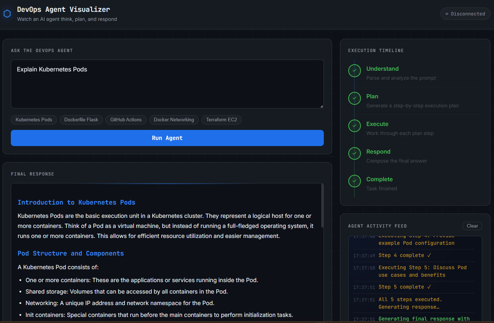

<div align="center">

# ⬡ DevOps Agent Visualizer

**Watch an AI agent think, plan, and respond — step by step.**

[](https://python.org)
[](https://fastapi.tiangolo.com)
[](https://groq.com)
[](https://vercel.com)
[](https://render.com)
[](LICENSE)

[Live Demo](https://devops-agent-visualizer.vercel.app/) · [Backend API](https://devops-agent-visualizer-api.onrender.com) · [Report Bug](https://github.com/KalpeshPatel06/devops_agent_visualizer/issues)



</div>

---

## What is this?

Most AI tools are black boxes — you type something in, an answer comes out. This project opens that box.

**DevOps Agent Visualizer** is an educational full-stack web application where you submit a DevOps prompt and watch every stage of the AI agent's workflow stream live to your browser via WebSockets:

```
Understand → Plan → Execute → Respond → Complete
```

Each stage lights up in real time as the agent works through it. You see the execution plan, every step being processed, and the final formatted response — all as it happens.

---

## Features

- **5-stage agentic workflow** visualized live — no black box
- **Real-time WebSocket streaming** — every agent event pushed to the browser instantly
- **LLM-powered planning** — Groq (LLaMA 3.3 70B) generates a structured plan before answering
- **Markdown response rendering** — code blocks, headings, and lists rendered beautifully
- **Dark terminal UI** — clean dashboard with animated execution timeline
- **Zero frameworks** — pure HTML, CSS, and Vanilla JS on the frontend
- **Fully deployed** — Vercel (frontend) + Render (backend) + GitHub CI/CD

---

## Tech Stack

| Layer | Technology |
|-------|-----------|
| Frontend | HTML5, CSS3, Vanilla JavaScript |
| Backend | Python, FastAPI, WebSockets |
| AI / LLM | Groq API — LLaMA 3.3 70B |
| Frontend Hosting | Vercel |
| Backend Hosting | Render |
| CI/CD | GitHub Actions (auto-deploy on push) |

---

## Architecture

```
┌──────────────────────────────────────────────────────────────┐
│  Browser — Vercel                                            │
│                                                              │
│  index.html + style.css + script.js                          │
│        │                                                     │
│        │  1. POST /ask → returns session_id                  │
│        │  2. WebSocket /ws/{session_id}                      │
│        │     ← stage events stream in real time              │
│        ▼                                                     │
│  ┌─────────────────────────────────────────────────────┐     │
│  │  FastAPI — Render                                   │     │
│  │                                                     │     │
│  │   main.py  ──►  agent.py                            │     │
│  │                  ├── understand()                   │     │
│  │                  ├── plan()  ──► groq_client.py     │     │
│  │                  ├── execute()                      │     │
│  │                  ├── respond() ──► groq_client.py   │     │
│  │                  └── finish()                       │     │
│  │                        │                            │     │
│  │                   Groq API                          │     │
│  │               (llama-3.3-70b-versatile)             │     │
│  └─────────────────────────────────────────────────────┘     │
└──────────────────────────────────────────────────────────────┘
```

---

## How the Agent Works

A regular chatbot does: `question → answer`.

This agent does:

| Stage | What happens |
|-------|-------------|
| **1. Understand** | Classifies the prompt — explanation, generation, or troubleshooting |
| **2. Plan** | Asks Groq to produce a 3–5 step execution plan |
| **3. Execute** | Simulates working through each plan step sequentially |
| **4. Respond** | Asks Groq for the full answer, guided by the plan |
| **5. Complete** | Delivers the formatted response and closes the connection |

---

## Project Structure

```
devops-agent-visualizer/
│
├── frontend/
│   ├── index.html          ← Dashboard UI
│   ├── style.css           ← Dark terminal theme
│   ├── script.js           ← WebSocket client + Markdown renderer
│   ├── vercel.json         ← Vercel deployment config
│   └── README.md
│
├── backend/
│   ├── main.py             ← FastAPI app + WebSocket endpoint
│   ├── agent.py            ← 5-stage agent workflow
│   ├── groq_client.py      ← Groq LLM API integration
│   ├── requirements.txt    ← Python dependencies
│   ├── render.yaml         ← Render deployment config
│   ├── .env.example        ← Environment variable template
│   └── README.md
│
├── .gitignore
├── LICENSE
└── README.md
```

---

## Getting Started

### Prerequisites

- Python 3.11+
- A free [Groq API key](https://console.groq.com)
- Git

### 1. Clone the repo

```bash
git clone https://github.com/KalpeshPatel06/devops-agent-visualizer.git
cd devops-agent-visualizer
```

### 2. Set up the backend

```bash
cd backend

# Create and activate virtual environment
python3 -m venv venv
source venv/bin/activate        # macOS / Linux
# venv\Scripts\activate         # Windows

# Install dependencies
pip install -r requirements.txt

# Configure environment
cp .env.example .env
```

Edit `.env` and add your key:

```env
GROQ_API_KEY=gsk_your_key_here
```

### 3. Run the backend

```bash
uvicorn main:app --reload --port 8000
```

### 4. Open the frontend

```bash
cd ../frontend
python3 -m http.server 3000
```

Open **http://localhost:3000** in your browser.

---

## Environment Variables

| Variable | Required | Default | Description |
|----------|----------|---------|-------------|
| `GROQ_API_KEY` | Yes | — | Get free at [console.groq.com](https://console.groq.com) |
| `GROQ_MODEL` | No | `llama-3.3-70b-versatile` | Groq model name |
| `PORT` | No | `8000` | Auto-set by Render in production |

---

## Deployment

### Backend → Render

1. Go to [render.com](https://render.com) → **New +** → **Web Service**
2. Connect your GitHub repository
3. Render auto-detects `render.yaml` — click **Create Web Service**
4. In the **Environment** tab add `GROQ_API_KEY` with your Groq key
5. Click **Save Changes** — Render deploys automatically

> Free tier note: Render spins down after 15 min of inactivity. First request after idle takes ~30s.

### Frontend → Vercel

1. Update `BACKEND_URL` in `frontend/script.js` to your Render URL:
   ```js
   const BACKEND_URL = window.BACKEND_URL || "https://your-service.onrender.com";
   ```
2. Push to GitHub
3. Go to [vercel.com](https://vercel.com) → **New Project** → import your repo
4. Set **Root Directory** to `frontend`
5. Click **Deploy**

---

## Example Prompts

| Prompt | What the agent produces |
|--------|------------------------|
| `Explain Kubernetes Pods` | Concept explanation with real-world analogies |
| `Generate a Dockerfile for a Flask app` | Production-ready Dockerfile with comments |
| `Create a GitHub Actions CI/CD workflow` | Complete workflow YAML |
| `Troubleshoot Kubernetes CrashLoopBackOff` | Step-by-step debugging guide |
| `Generate Terraform code for an AWS EC2 instance` | Working HCL with IAM best practices |
| `Explain Docker networking` | Bridge, host, overlay networks explained |
| `Create a docker-compose for Django + Postgres` | Full compose configuration |

---

## Troubleshooting

**`Failed to fetch` on first request**
→ Check that `BACKEND_URL` in `script.js` points to your Render URL, not `localhost`

**`%%CODE_BLOCK%%` showing in response**
→ Make sure you're using the latest `script.js` with the fixed Markdown renderer

**`GROQ_API_KEY not set`**
→ Copy `.env.example` to `.env` and add your key; make sure your venv is activated

**Backend takes 30+ seconds**
→ Render free tier cold start — normal on first request after inactivity

---

## Future Enhancements

- [ ] Chat history with session replay
- [ ] JWT authentication
- [ ] Real Docker command execution in a sandbox
- [ ] LangGraph-based multi-agent system
- [ ] Agent memory across conversations
- [ ] Monitoring dashboard with latency metrics

---

## License

MIT — see [LICENSE](LICENSE)

---

<div align="center">

Built with Python · FastAPI · Groq · Vanilla JS

</div>
